# 离散数学 第一章 知识点复习

@gylidian

最后修改时间: 2019/1/10 08:22

---

#### 命题

**命题**: 判断结果唯一的`陈述句`

**命题的真值:** 判断的结果

**真值的取值**: 真与假

**真命题**: 真值为真的命题

**假命题**: 真值为假的命题

> 注意: 
>
> 感叹句、
>
> 祈使句、
>
> 疑问句、
>
> ==陈述句中的悖论==、//我在说谎
>
> ==判断结果不唯一确定的==   //x+5>3
>
> 都不是命题

#### 命题的分类

**简单命题(原子命题)**: 简单陈述句构成的命题 

**复合命题**: 由简单命题与联结词按一定规则复合而成的命题 

命题常项(常元)

命题变项(变元)

#### 命题联结词

1. 否定式    否定联结词 `¬`  **非**
2. **合取**式    合取联结词 `∧`  **且**
3. **析取**式    析取联结词 `∨`  **或**
   1. **相容或**(**可兼或**) 当命题P和Q的真值都为真时，其值也为真
   2. 排斥或  要么  要么
4. 蕴涵式    蕴涵联结词 `→` 
     p→q，p是蕴涵式的前件，q为蕴涵式的后件， ==q 为 p 的必要条件==（p被q包含啦）
       **前真后假才为假**
       当P 则 Q、仅当...则... **Q→P**、P **仅当Q**
       只要P 就Q、如果P 那么Q
       因为P 所以Q
       **只有Q** 才 P、**除非Q** 才 P、
       否则非 ……、
5. 等价式    等价联结词 `↔`
     p↔q，当且仅当    **p和q同时为真 同时为假**    就是真
     逻辑关系: p与q 互为 充分必要条件

联结词的优先顺序为： `¬`   `∧`  `∨`   `→`  `↔` 
如果出现的联结词同级，又无括号时，则按从左到右的顺序运算; 
若遇有括号时，应该先进行括号中的运算.

命题联结词的扩充

6. ⊕排斥(异或)
7. ↑ 与非
8. ↓ 或非

#### 命题公式

- 单个命题变元是合式公式，并简称为原子命题公式；
- 如果A是合式公式，那么(﹁A)也是合式公式；
- 如果A, B都是合式公式，那么   (A∧B ), (A∨B ), (A****B ), (AB )都是**合式公式**（==也都是重言式==)
- 当且仅当**有限次**地应用1), 2), 3)所得到的包含命题变元、联结词和括号的字符串是合式公式

#### 合式公式的层次

>     p					0层
>     ¬p					1层
>     ¬p→q				2层
>     ¬(p→q)↔r			3层
>     ((¬p∧q)→r)↔(¬r∨s)	4层

#### 公式的赋值

定义 给公式A中的命题变项 p1, p2, … , pn指定一组真值称为对A的一个**赋值**或**解释**

**成真赋值**: 使公式为真的赋值

**成假赋值**: 使公式为假的赋值

**真值表**: 公式A在所有赋值下的取值情况列成的表

#### 公式的类型

  (1) 若A无成假赋值，则称A为**==重言式==**(也称**永真式**)

  (2) 若A无成真赋值(**不是重言式**)，则称A为**矛盾式**(也称**永假式**)

  (3) 若A**不是矛盾式**，则称A为**==可满足式==**

#### ==命题符号化==

#### 逻辑等价

真值表相同（任一组赋值 得到的两公式的真值都相同）

AB

#### ==✨逻辑等价公式（**熟记**）==

双重否定 A﹁﹁A                  

幂等律 AA∨A 、AA∧A

交换律 A∨BB∨A、 A∧BB∧A

结合律 (A∨B)∨CA∨(B∨C) 、(A∧B)∧CA∧(B∧C)

分配律

​	**A∨** (B∧C) (A∨B)∧(A∨C) （**∨对 ** ∧的分配律）

​	**A∧** (B∨C) (A∧B)∨(A∧C) （**∧对 ** ∨的分配律）

德摩根律

​	==﹁==(A==∨==B) **﹁**A==∧==**﹁**B

​	==﹁==(A==∧==B) ﹁A==∨==﹁B

零律 A∨11 、A∧00

同一律 A∧1A 、A∨0A	

排中律 A ==∨==**﹁A**  **1**

矛盾律 A ==∧==**﹁A**  **0**

**蕴涵律 A==→==B==﹁==A==∨==B** 

**等价律AB(A==→==B)==∧==(B==→==A)**

假言易位律 A→==B====﹁B==→﹁A

**等价否定**律AB﹁A﹁B

归谬律 (A==→B==)==∧==(A→==﹁B==) ==﹁==A

#### 等值演算与置换规则 

等值演算: 

  由已知的等值式推演出新的等值式的过程

置换规则：若AB, 则F(B)F(A) 

等值演算的基础：

(1) 等值关系的性质：自反、对称、传递

(2) 基本的等值式

(3) 置换规则 

#### 对偶

在给定的`仅使用联结词﹁, ∧, ∨的命题公式`A中，若**把∧和∨互换**，**0和1互换** 

而得到一个命题公式A\*，则称A\*是A的对偶式。

显然，A也是A\*的对偶式；可见，A\*和A互为对偶式且(A\*)\*=A

**设A和B是两个命题公式，若AB，则A\*B***

#### 范式

一个**简单析取式**   是   **重言式** 当且仅当  它同时含某个命题变元及它的否定式。     ∨∨∨

一个**简单合取式**   是   **矛盾式** 当且仅当  它同时含某个命题变元及它的否定式。     ∧∧∧

**析取、合取范式**

1）由有限个简单合取式构成的析取式  称为  **析取范式**。

2）由有限个简单析取式构成的合取式  称为  **合取范式**。

3）析取范式与合取范式统称为范式。

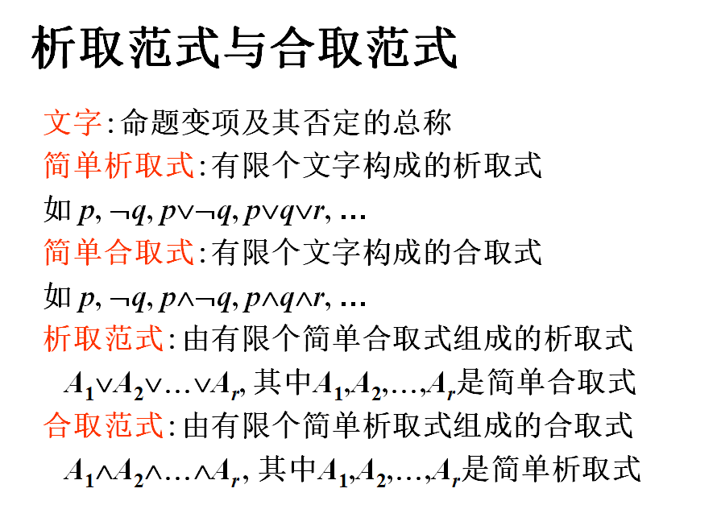

一个**文字** 既是 **简单析取式∨∨∨** 又是 **简单合取式∧∧∧∧∧**

析取范式 是由 一堆简单合取式∧∧∧构成的     ∨∨∨∨∨

合取范式 是由 一堆简单析取式∨∨∨构成的     ∧∧∧∧∧

**任何命题公式都存在着与之等值的析取范式与合取范式**

#### ==**求公式A的范式的步骤**==

​    (1) **消去****→ , **

​    (2) 否定联结词**﹁  的内移或消去** 

​		双重否定 A﹁﹁A

​		德摩根律 ﹁(A==∨==B) **﹁**A==∧==**﹁**B,  ﹁(A==∧==B) ﹁A==∨==﹁B

​    (3) 使用分配律   ∧对∨分配（析取范式）   ∨对∧分配（合取范式）   和   结合律

#### 极小项与极大项 

在含有n个命题变项的简单合取式(简单析取式)中，

**若每个命题变项均以文字的形式出现且仅出现一次**，

称这样的 **简单合取式**(`简单析取式`) 为 **极小项(`极大项`）**

> 说明：
>
> n个命题变项产生2n个极小项和2n个极大项
>
> 2n个极小项（极大项）均互不等值
>
> 在极小项和极大项中文字均按下标或字母顺序排列
>
> 用mi表示第i个极小项，其中i是该极小项成真赋值的十
>
>   进制表示.  用Mi表示第i个极大项，其中i是该极大项成
>
>   假赋值的十进制表示, mi(Mi)称为极小项(极大项)的名称. 
>
> mi与Mi的关系:  ﹁miMi ,   ﹁Mimi 

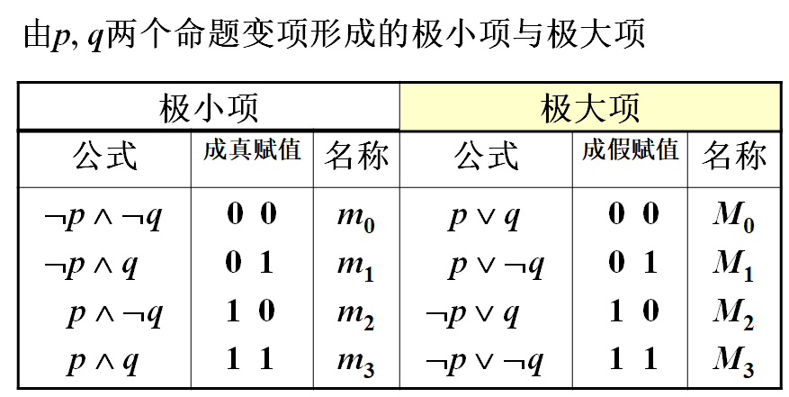

#### 主析取范式与主合取范式 

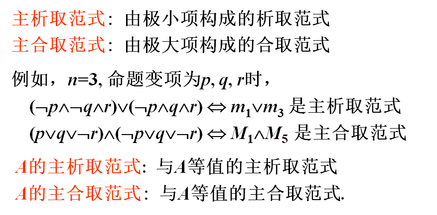

**任何命题公式都存在着与之等值的主析取范式和主合取范式, 并且是唯一的**

#### ==用 等值演算法 求公式的主范式 的步骤==

(1) 先求析取范式（合取范式）

**(2)** 将  **不是极小项**（极大项）的**简单合取式**（简单析取式）

​	化成

​	与之等值的   **若干个极小项的析取**（极大项的合取）

需要利用同一律（零律）、排中律（矛盾律）、分配律、幂等律等

*(3) 极小项（极大项）用名称mi（Mi）表示，并按角标从小到大顺序排序*

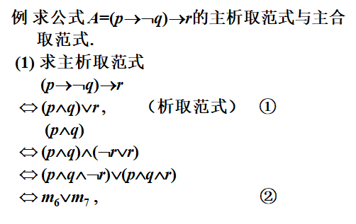

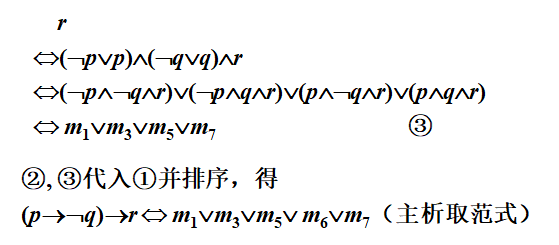

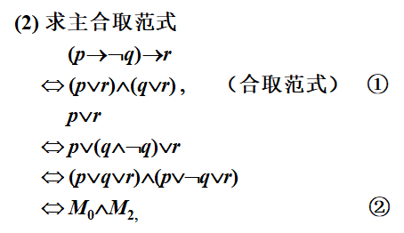

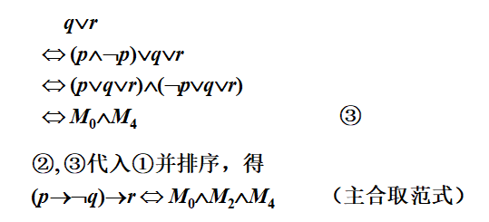

#### 主范式的用途——与真值表相同

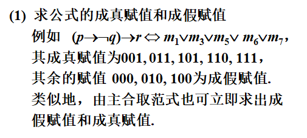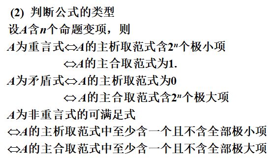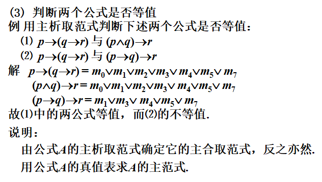

##### ==例题==

例  某公司要从赵、钱、孙、李、周五名新毕业

的大学生中选派一些人出国学习. 选派必须满足

以下条件：    

  (1)若赵去，钱也去；

  (2)李、周两人中至少有一人去；

  (3)钱、孙两人中有一人去且仅去一人；

  (4)孙、李两人同去或同不去；

  (5)若周去，则赵、钱也去. 

试用主析取范式法分析该公司如何选派他们出国？

> **解此类问题的步骤为：**
>
> **① 将简单命题符号化**
>
> **② 写出各复合命题**
>
> **③ 写出由②中复合命题组成的==合取式∧∧∧∧∧==**     并且并且并且并且并且
>
> **④ 求③中所得公式的==主析取范式∨∨∨∨∨==**     把各个极小项 并上   就是最终结果啦（其实就是个 只有一个文字的 大合取式）

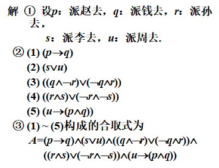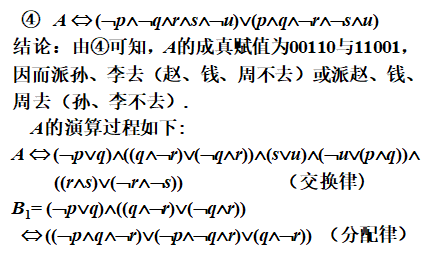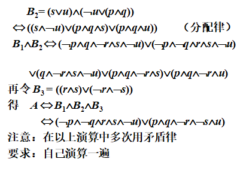

#### 推理理论 

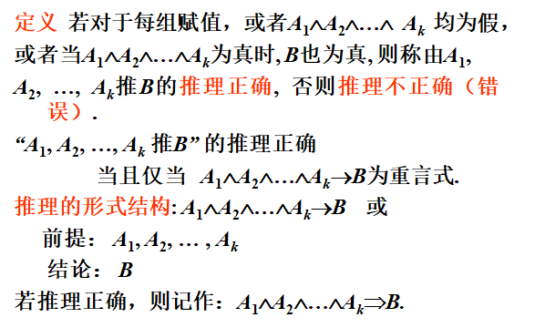

##### 判断推理是否正确的方法

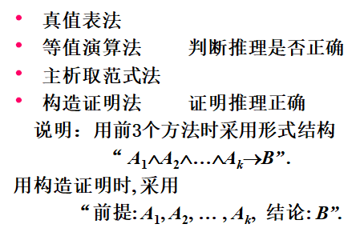

##### 例题

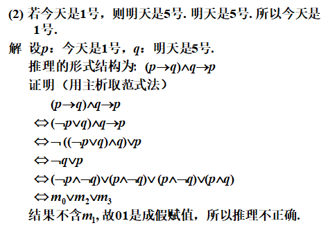

#### ==✨推理定律——重言蕴涵式==

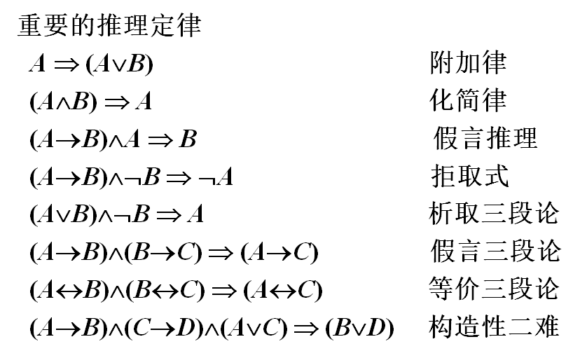

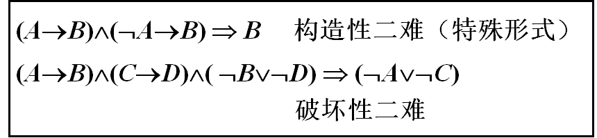

#### ==**证明**==

描述推理过程的命题公式序列，其中每个命题公式或者是已知的前提，或者是由前面的命题公式应用推理规则得到的结论.

##### ==✨推理规则==

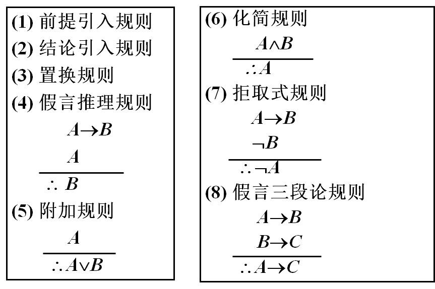

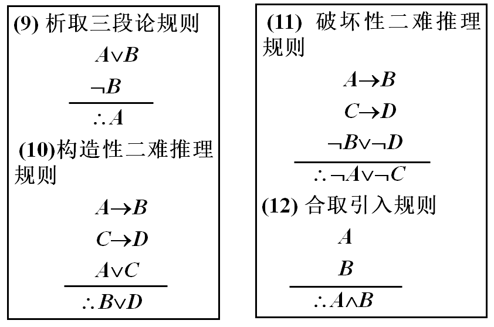

##### 构造证明之一——直接证明法

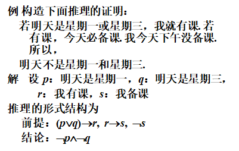

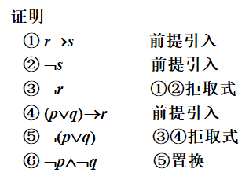

##### 构造证明之二——附加前提证明法 

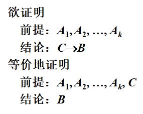

例题

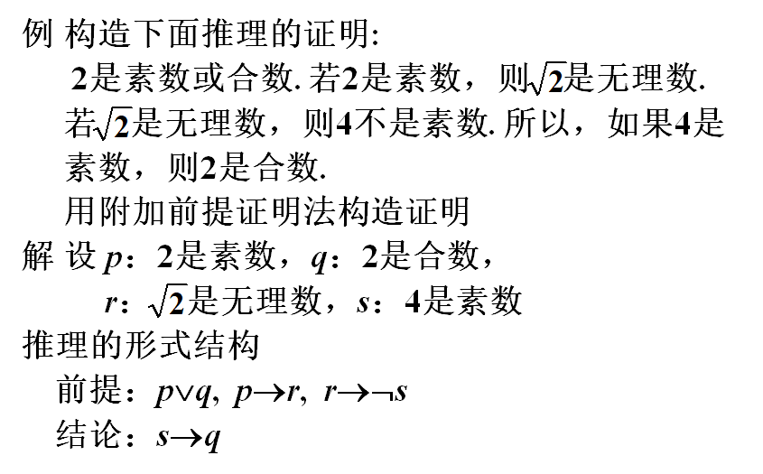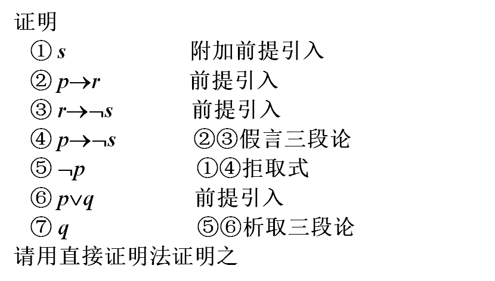

##### 构造证明之三——归谬法(反证法)

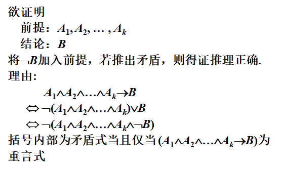

例题

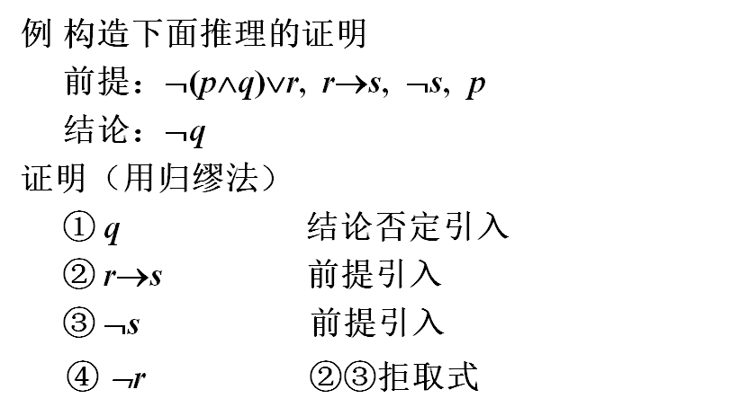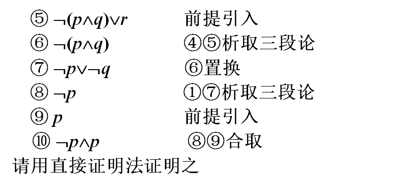