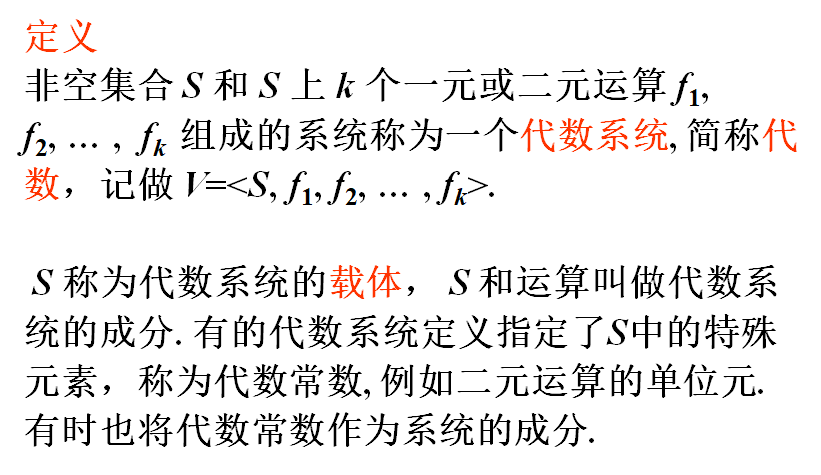
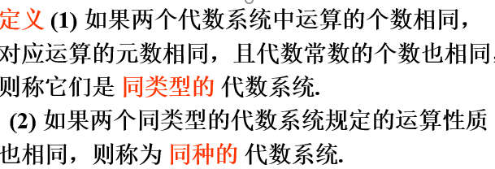
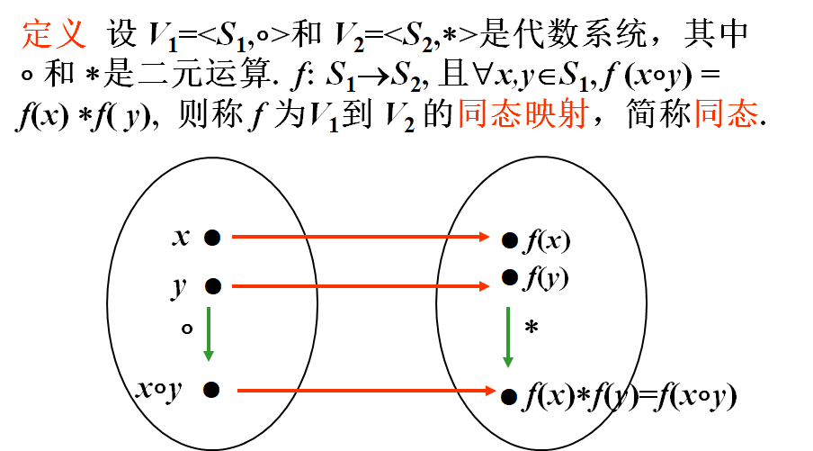
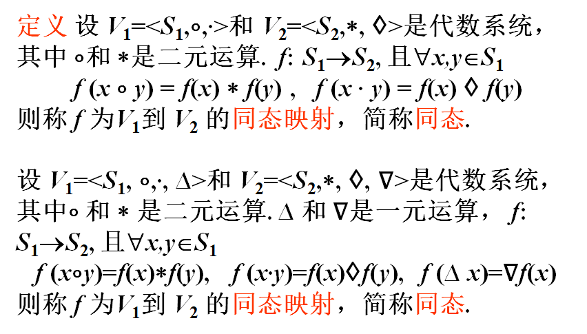
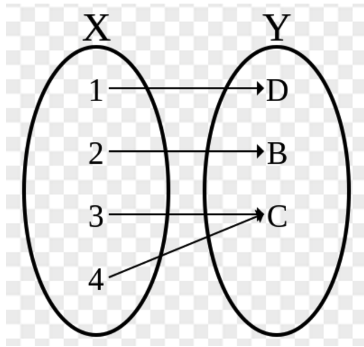
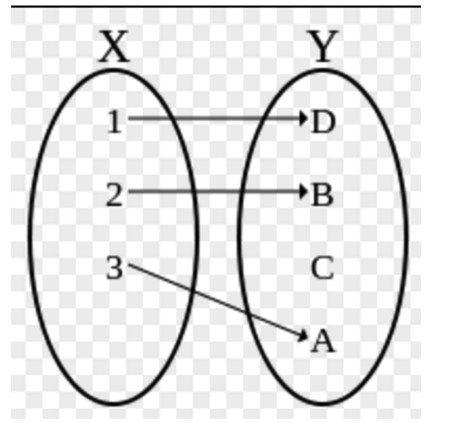
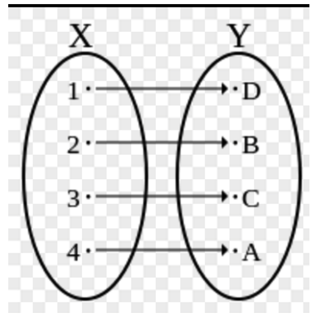
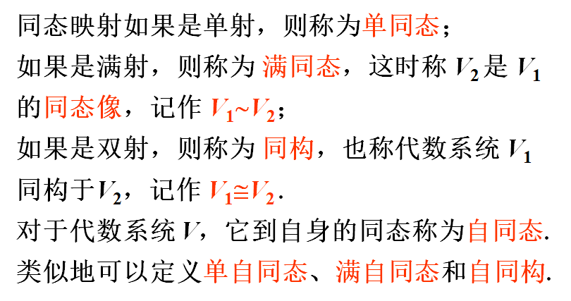
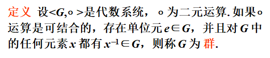

# 第七章 代数系统

@gylidian

最后修改时间: 2019/1/10 06:17

------

> 第七章 知识仅作了解
>
> 主要看那三个例题

#### ==代数系统定义==

#### 同类型与同种代数系统

#### 子代数

#### ==同态映射==

#### 单射、满射和双射

**满射**：对任意b，存在a满足f(a) = b。

即：值域y是满的。**每个y都有x对应**。不存在某个y没有x对应的情况。

**单射**：(one-to-one function) **一对一**函数。x不同则y不同。

即：没有一个x对应两个y，也没有一个y有对应两个x。

**双射**：**既是满射，也是单射**

即：**每个y都有x对应**。而且都是**一一对应**。

#### ==特殊同态映射==的分类

#### ==群的定义==

**证明步骤**

1. 首先说明(G,○) 是**代数系统**，证明对面映射过来的所有 $a○b∈G$
2. 满足**结合律**: 对于任意 $a,b,c∈G$，都有 $(a○b)○c=a○(b○c)$
3. 存在单位元e: 对于任意 $a∈G$，都有 $ea=ae=a$ （e **是G的单位元**）
4. 对于G中的任意元a，都有 $a^{-1}∈G$，使得 $aa^{-1}=a^{-1}a=e$（**G的每一个元素都有逆元**）(a是可逆的，$a^{-1}$称为可逆元)

8il