# 第三章 集合 复习

@gylidian

最后修改时间: 2019/1/10 07:31

------

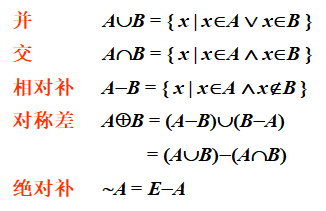

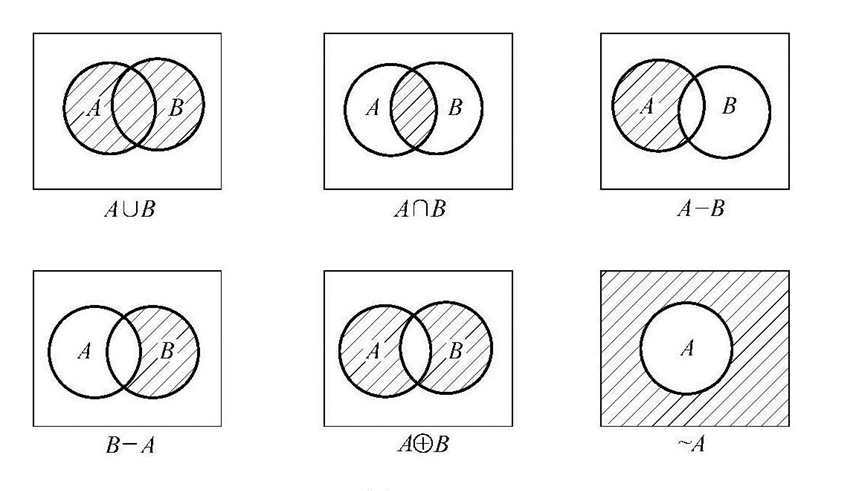

#### 集合运算的算律

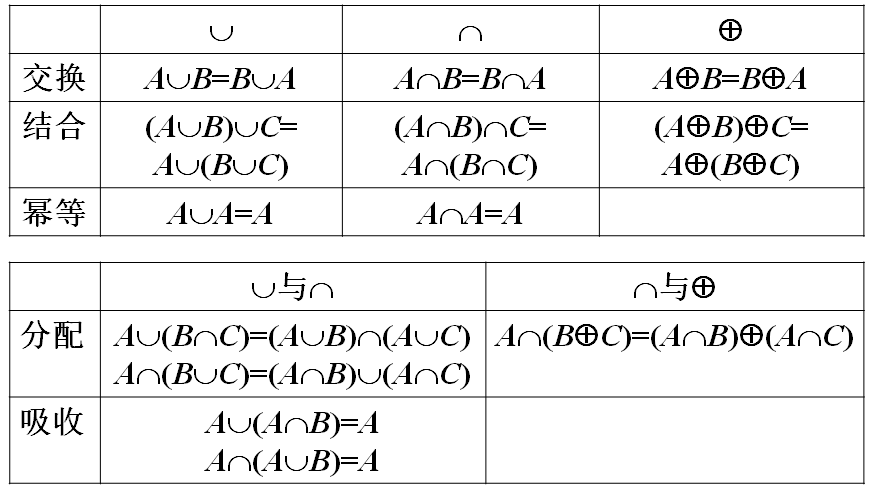

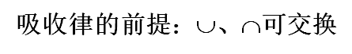

补交转换律：**A-B=A∩~B**

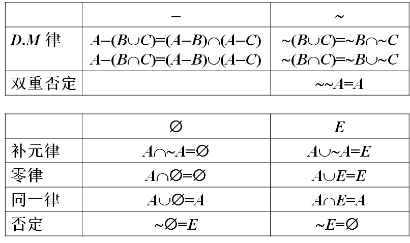

#### ==包含排斥原理==

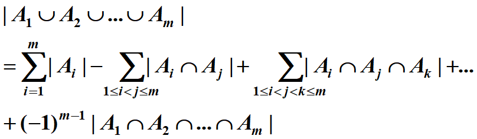

就2个的话， 前∪后∩   前∩后∪

例题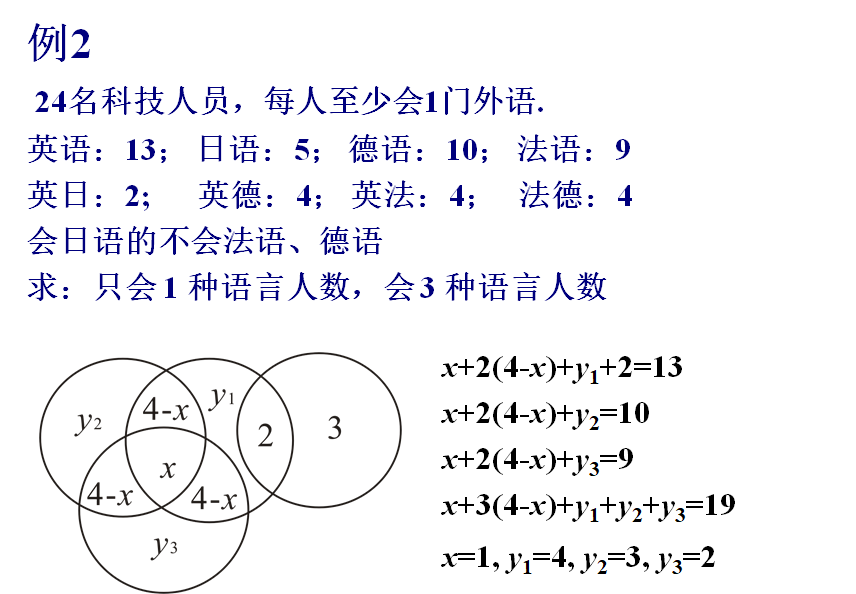

#### 幂集合

无次序

把一个集合的  0元、1元、2元....按顺序列出来然后合起来

P(A)=    {A的所有**子集**}   

#### ==笛卡尔积==

有次序

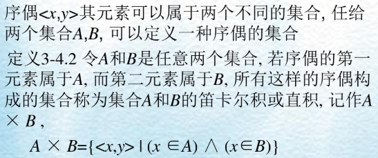

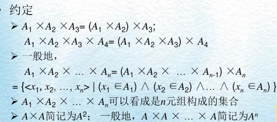

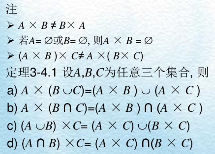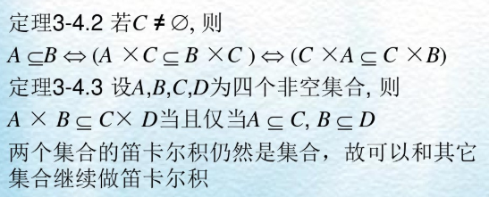

