# 第四章 二元关系 复习

@gylidian

最后修改时间: 2019/1/10 07:18

------

#### 有序对

由两个客体 x 和 y，按照一定的顺序组成的

​     二元组称为 **有序对**，记作**<x,y>**

有序对性质
​      有序性  <x,y>≠<y,x> （当x≠y时）  
​     <x,y> 与 <u,v> 相等的充分必要条件是
​                 <x,y>=<u,v>   <=>   x=u ∧ y=v

#### 笛卡儿积的性质

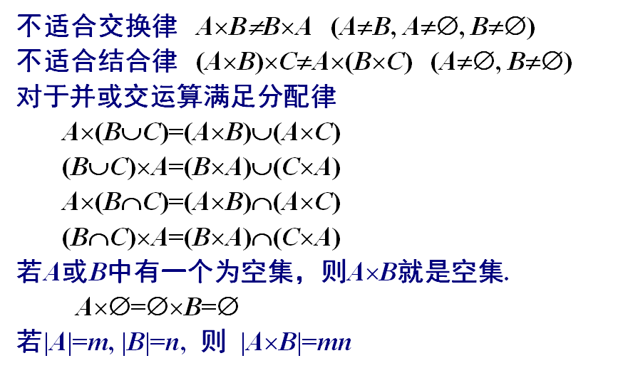

#### 二元关系

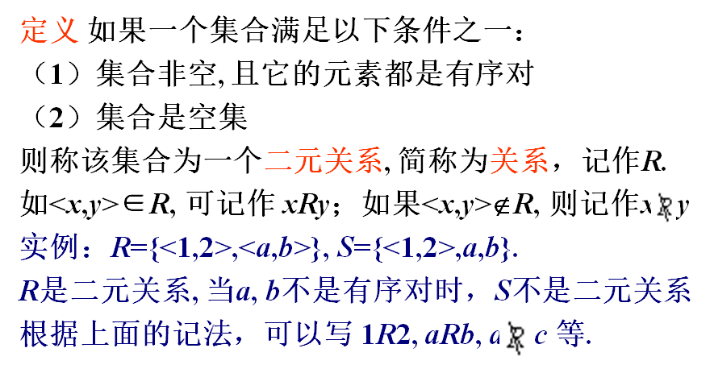

#### 从A到B的关系与A上的关系

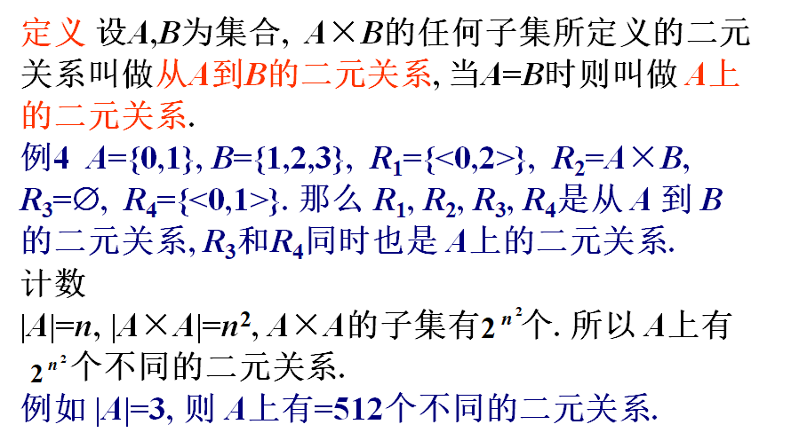

#### A上重要关系的实例

>  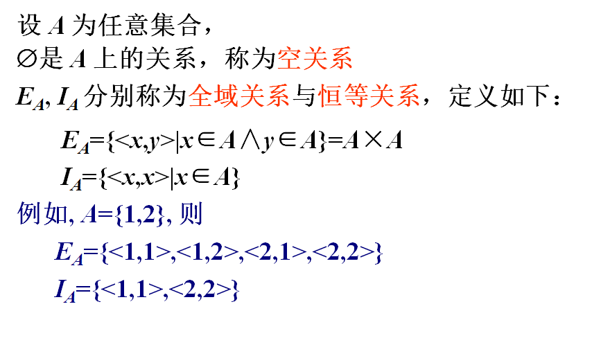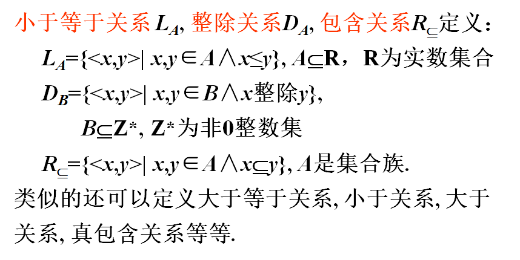

#### 关系的表示

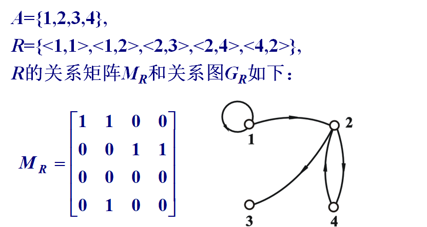

#### ==关系的运算==

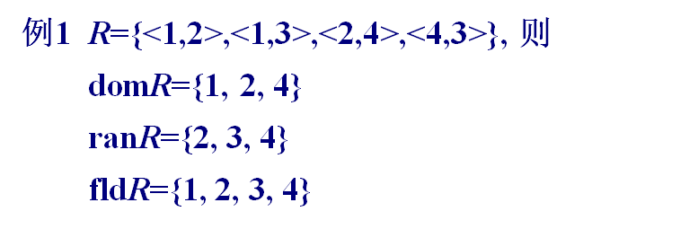

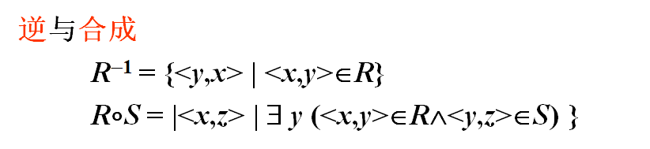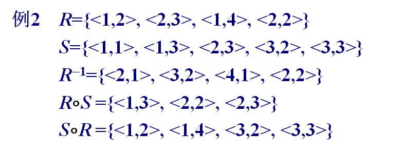

#### 关系基本运算的性质 

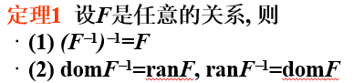

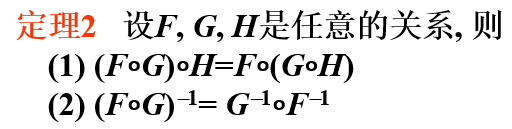

就是说，满足结合律    然后一前一后  变 一后^-1^一前^-1^

> #### A上关系的幂运算
>
> 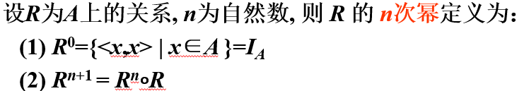
>
> 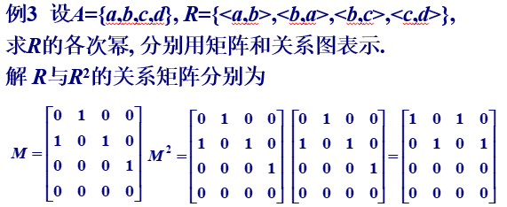
>
> 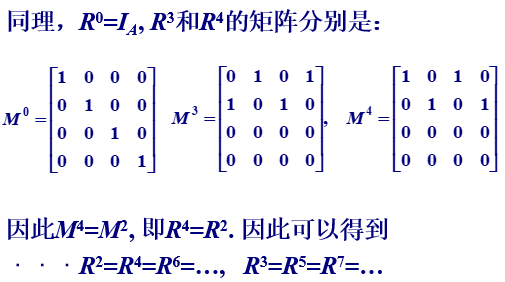
>
> 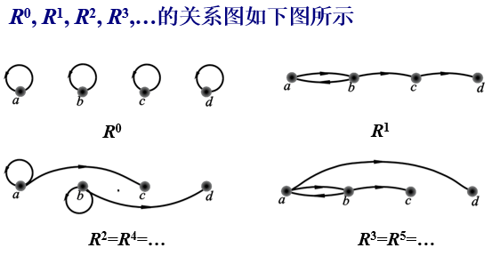
>
>
>
> #### 幂运算的性质
>
> 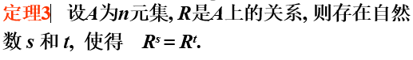
>
> 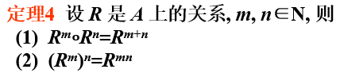
>
>

#### 关系的性质

**自反 **任取一个A中的元素x，如果都有**<x,x>**在R中，那么就成R在A上是自反的
**反自反 **任取一个A中的元素x，如果都有<x,x>**不在**R中，那么就成R在A上是反自反的

在关系矩阵上的表示，
自反：**主对角线**上的元素**都是1**
反自反：主对角线上的元素都是0

在关系图上的表示，
自反：每一个顶点**都有环**
反自反：每一个顶点都没有环

对称性：关系矩阵关于主对角线对称  <x,y>  <y,x>
**反对称**性：关系矩阵关于主对角线不对称或者非主对角线上元素全部为0

传递：  如果<a,b>，<b,c>是R的元素，那么<a,c>是R的元素

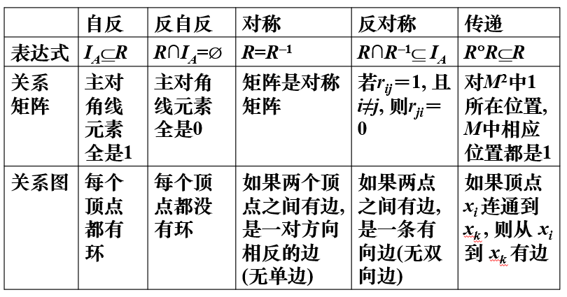

#### ==关系的闭包==

#### 闭包的构造方法

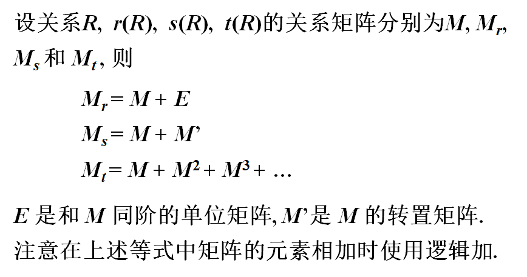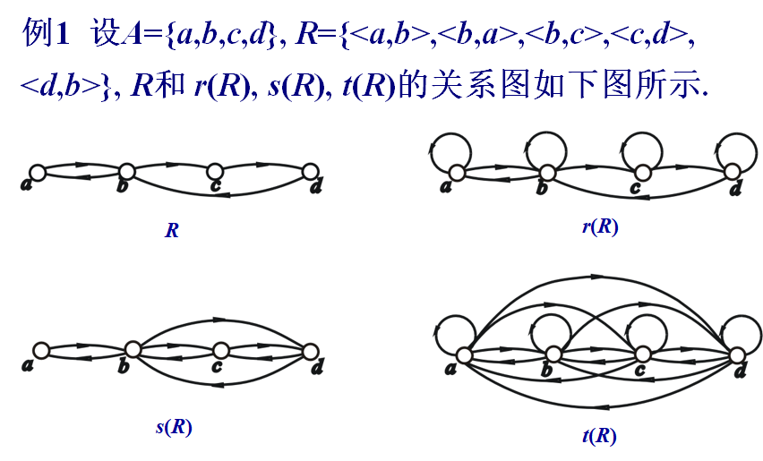

#### ==偏序关系==

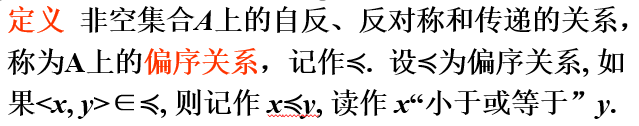

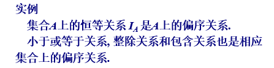

#### ==偏序集的哈斯图==

**利用偏序自反、反对称、传递性简化的关系图**

特点：

每个结点**没有环**，

两个连通的结点之间的**序关系**通过**结点水平位置**的**高低**表示，放在后面的元素画得越高

**具有覆盖关系的两个结点之间连边**

==**求一个偏序集的盖住关系**==

1. 去掉所有<x,x>

2. 再破坏掉传递性：==若<x,y>，<y,z>，~~<x,z>~~ 都在，则去掉 ~~<x,z>~~==

剩下的就是**COV(A)** 也就是**盖住关系**

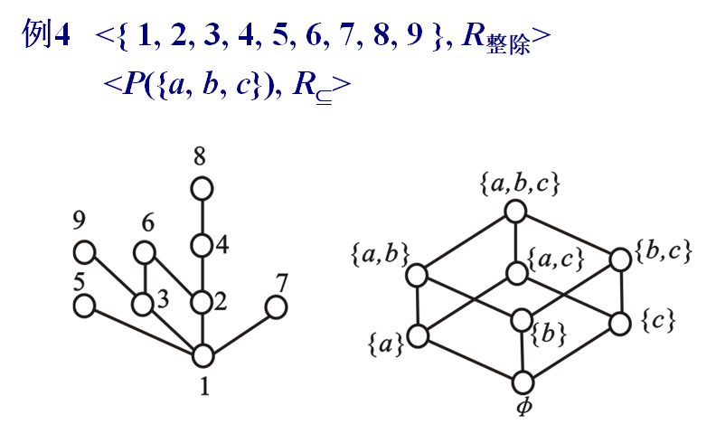